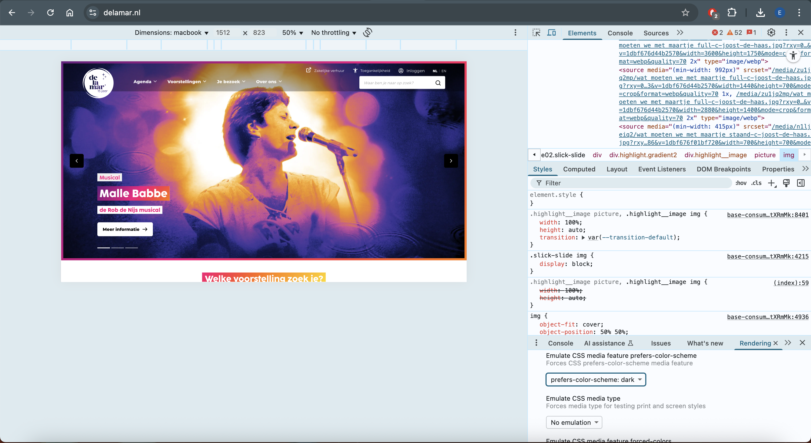
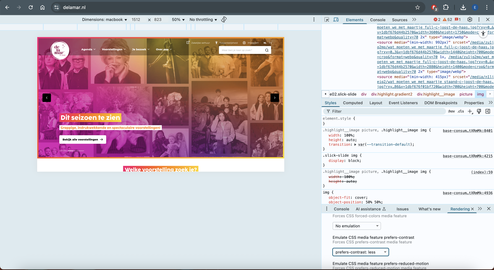
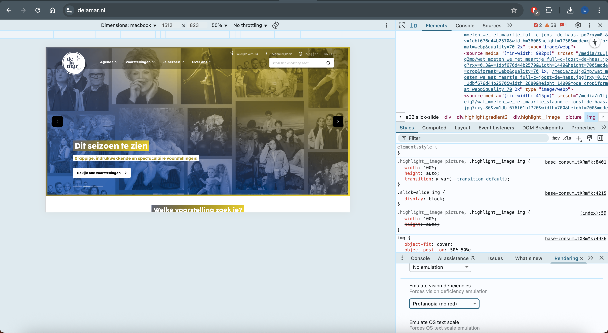
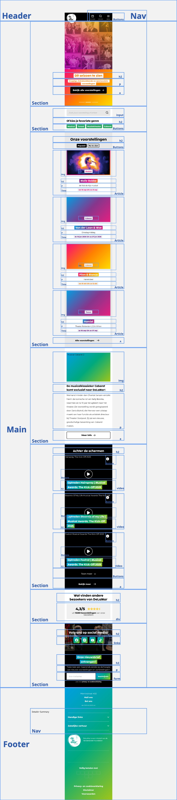
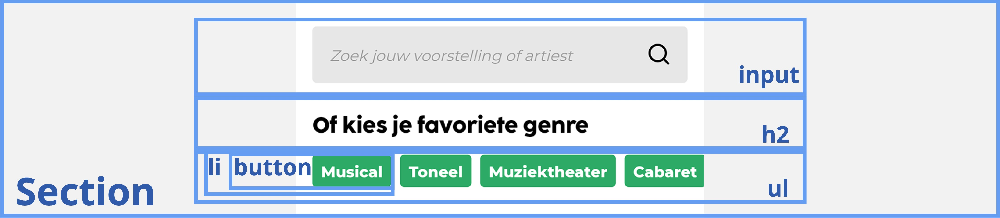
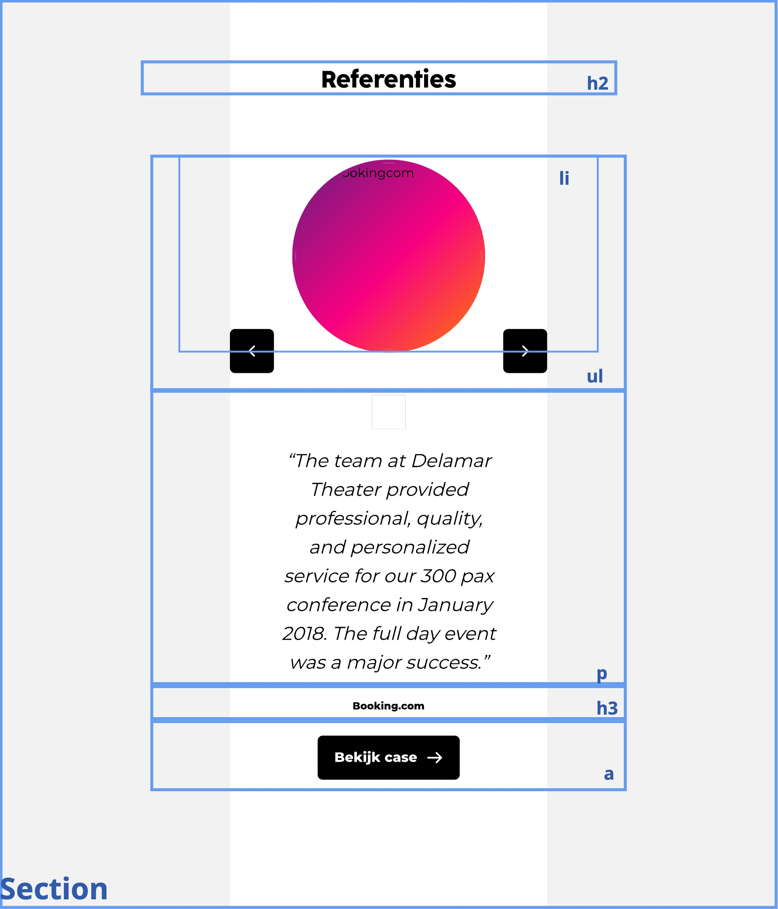

# Procesverslag
Markdown is een simpele manier om HTML te schrijven.  
Markdown cheat cheet: [Hulp bij het schrijven van Markdown](https://github.com/adam-p/markdown-here/wiki/Markdown-Cheatsheet).

Nb. De standaardstructuur en de spartaanse opmaak van de README.md zijn helemaal prima. Het gaat om de inhoud van je procesverslag. Besteedt de tijd voor pracht en praal aan je website.

Nb. Door *open* toe te voegen aan een *details* element kun je deze standaard open zetten. Fijn om dat steeds voor de relevante stuk(ken) te doen.

## Jij

  
uitwerken voor kick-off werkgroep

  ### Auteur:
  Eliza Wentzel

  #### Je startniveau:
  Blauw (kies uit zwart, rood óf blauw)

  #### Je focus:
  surface plane (kies uit responsive óf surface plane)
 

## Je website

  
De website die ik zal namaken is van DeLaMar. Ik zal hierbij de thuispagina en zakelijke pagina recreeeren, waarbij mij focus zal liggen op de surface plane.

  ### Je opdracht:
  <url src="https://delamar.nl/">
  <url src="https://delamar.nl/zakelijk/">

  #### Screenshot(s) van de eerste pagina (small screen): 
  hier de naam van de pagina  
  

  #### Screenshot(s) van de tweede pagina (small screen):
  hier de naam van de pagina  
  
 

## Toegankelijkheidstest 1/2 (week 1)

  
uitwerken na test in 2e werkgroep

  ### Bevindingen
  Lijst met je bevindingen die in de test naar voren kwamen:
  
  screenreader
  - De website heeft een sematisch correcte opbouw met header,main,footer etcetera. Hierdoor worden de headings ook goed en op een logische wijze opgelezen door de screenreader.
  - Bij sommige teksten is het niet goed aangegeven in de HTML dat het nederlandse taal is, waardoor de screenreader in het engels blijft praten, dit is moeilijk te verstaan.
  - De alt teksten bij de foto's zijn niet altijd zo duidelijk, ze zeggen niet genoeg over wat er te zien is op de foto.
  - De carousels die vaak gebruikt worden op de website zijn niet goed toegankelijk voor de screenreader, de screenreader leest niet de nieuwe info op wanneer de carousel naar het volgende plaatje schuift. Hierdoor mist de gebruiker informatie.
  - De links worden wel goed opgelezen, maar zijn niet altijd duidelijk waar ze bij horen. Dit kan verwarrend worden voor de gebruiker.
  
  WCAG
  - er is geen skip link aanwezig
  - De website heeft geen ondersteuning voor dark mode of hoog contrast

  
  - er is geen optie om de carousel op pauze te zetten
  - geen optie voor prefers-reduced-motion
  - de website was nog goed te lezen voor mensen die kleurenblind zijn
  
  
    

## Breakdownschets (week 1)

  
uitwerken na afloop 3e werkgroep

  ### de hele pagina: 
  

  ### dynamisch deel (bijv menu): 
  
  

    Dynamisch onderdeel: carrousel die je kan bedienen door middel van knoppen
  

  ### wellicht nog een dynamisch deel (bijv filter): 
  
   

     Dynamisch onderdeel: swipable menu voor genres
  

## Voortgang 1 (week 2)

  
uitwerken voor 1e voortgang

  ### Stand van zaken
  hier dit ging goed & dit was lastig (neem ook screenshots op van delen van je website en code)
  Goed:
  Het enige dat tot nu toe goed is gegaan is de html invoeren zodat alle info er alvast instaat. Dit helpt mij om daarna volledig te kunnen focussen op de css en javascript.
  
  Lastig:
  Het opzetten van de website ging lastig voor mij. Ik moest heel erg weer inkomen met coderen. Ik kreeg de breedte van het scherm niet goed, maar na hulp te vragen was het mij wel gelukt. 
  Ik kwam er ook jammer genoeg achter dat ik een te moeilijke website heb gekozen. Hierdoor duurt het voor mij heel lang om de website op te bouwen. Ik zal niet van website switchen maar wel de website iets versimpelen zodat ik het binnen de tijd die we hebben wel af kan krijgen.

  ### Agenda voor meeting
  samen met je groepje opstellen

  | student 1      | student 2          | student 3    | student 4        |
  | ---            | ---                | ---          | ---              |
  | dit bespreken  | en dit             | en ik dit    | en dan ik dat    |
  | en dat ook nog | dit als er tijd is | nog een punt | dit wil ik zeker |
  | ...            | ...                | ...          | ...              |

  ### Verslag van meeting
  hier na afloop snel de uitkomsten van de meeting vastleggen

  - geen buttons gebruiken voor linkjes, hiervoor gebruik je <a>
  - om een dropdown menu te maken kan je het beste 
 en 
 gebruiken, door deze te gebruiken zal er vanzelf een dropdown menu gecreeërd worden
  - het is niet zo gebruikelijk om alles in je main te zetten. Dit kan je beter alleen houden voor het belangrijkste van de pagina
  - read-me is duidelijk opgesteld en goed dat er plaatjes bij de wgac staan als voorbeeld.
  - update goed je Github voor betere feedback

## Voortgang 2 (week 3)

  
uitwerken voor 2e voortgang

  ### Stand van zaken
  hier dit ging goed & dit was lastig (neem ook screenshots op van delen van je website en code)
  
  Goed:
  Het coderen van de code gaat vlot en soepel. Ik loop tegen weinig problemen aan gelukkig. Als ik ergens echt niet uitkom vraag ik het aan de docent of Chatgpt. Ik ben wel goed in CSS, ik vind dit ook leuk om te doen. Javascript heb ik zeker wel vaker een handje bij nodig.

  Slecht: 
  Javascript vind ik best lastig nog. Hier loop ik soms tegenaan als ik bijvoorbeeld een carrousel moet maken of ander dynamisch onderdeel. Maar met de docent en Chatgpt aan mijn zij kom ik er wel doorheen.

  ### Agenda voor meeting
  samen met je groepje opstellen

  | student 1      | student 2          | student 3    | student 4        |
  | ---            | ---                | ---          | ---              |
  | dit bespreken  | en dit             | en ik dit    | en dan ik dat    |
  | en dat ook nog | dit als er tijd is | nog een punt | dit wil ik zeker |
  | ...            | ...                | ...          | ...              |

  ### Verslag van meeting
  hier na afloop snel de uitkomsten van de meeting vastleggen

  - punt 1
  - punt 2
  - nog een punt
- ...

## Toegankelijkheidstest 2/2 (week 4)

  
uitwerken na test in 9e werkgroep

  ### Bevindingen
  Lijst met je bevindingen die in de test naar voren kwamen (geef ook aan wat er verbeterd is):

## Voortgang 3 (week 4)

  
uitwerken voor 3e voortgang

  ### Stand van zaken
  hier dit ging goed & dit was lastig (neem ook screenshots op van delen van je website en code)

  ### Agenda voor meeting
  samen met je groepje opstellen

  | student 1      | student 2          | student 3    | student 4        |
  | ---            | ---                | ---          | ---              |
  | dit bespreken  | en dit             | en ik dit    | en dan ik dat    |
  | en dat ook nog | dit als er tijd is | nog een punt | dit wil ik zeker |
  | ...            | ...                | ...          | ...              |

  ### Verslag van meeting
  hier na afloop snel de uitkomsten van de meeting vastleggen

  - punt 1
  - punt 2
  - nog een punt
  - ...

## Eindgesprek (week 5)

  
uitwerken voor eindgesprek

  ### Je uitkomst - karakteristiek screenshots:
  

  ### Dit ging goed/Heb ik geleerd: 
  Korte omschrijving met plaatjes

  

  ### Dit was lastig/Is niet gelukt:
  Korte omschrijving met plaatjes

  

## Bronnenlijst

  
continu bijhouden terwijl je werkt

  Nb. Wees specifiek ('css-tricks' als bron is bijv. niet specifiek genoeg). 
  Nb. ChatGpT en andere AI horen er ook bij.
  Nb. Vermeld de bronnen ook in je code.

  Afbeeldingen en svg's:
bron: https://delamar.nl/
https://delamar.nl/zakelijk

  bronnen coderen:
  1. Zoom effect, bron: ChatGPT - prompt:"Hoe creeër ik een zoom in effect op een img zoals bij delamar?"
  2. Filterknoppen Javascript, bron: ChatGPT - prompt:"I want to have the first button stay a certain way, but the second needs to only have a black border and no background color and black letters instead of white. I want it to be able to switch back to the style of the first button when you click on it and that the first button will change to the no border etc. How will i achieve this?"
  3. video-placeholder css, bron: ChatGPT - prompt: "I want to add multiple videos that have a playbutton in the middle en a information icon on de upper right, What is the best way to do this?"
  4. carrousel, bron: https://codepen.io/shooft/pen/QwjQGZe
  5. hamburger menu, bron: https://codepen.io/shooft/pen/myepoJo
  6. Checkmark list-style, bron: https://stackoverflow.com/questions/34141950/how-to-use-tick-checkmark-symbol-instead-of-bullets-in-unordered-list
     7. partners grid, bron: ChatGPT - prompt: "Ik krijg de groottes van de logo's niet gelijk, waardoor ze niet goed in de grid komen te staan, wat doe ik verkeerd?"
     8. social media carrousel, bron: youtube -https://www.youtube.com/watch?v=nAjR0Oj0J8E
     9. carrousel referenties, bron: ChatGPT - prompt: ik heb dit als javascript voor mijn carrousel, maar hij doet het niet. Kan je mij hiermee helpen?
     10. hamburger menu, bron:https://codepen.io/elizaWentz/pen/JoGYBEr 

